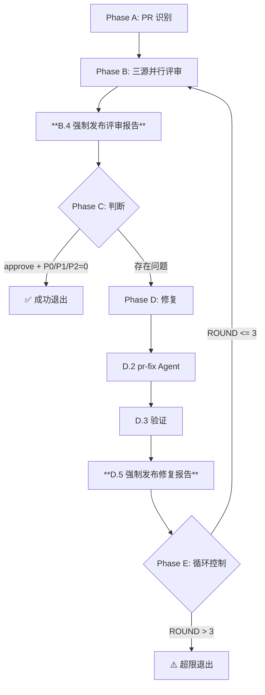

## Usage

```bash
# 自动识别当前分支 PR
/pr-review-loop

# 显式指定 PR
/pr-review-loop --pr <PR_NUMBER>

# nocodex 模式（pr-fix 直接修复，不委托 Codex CLI）
/pr-review-loop --nocodex
```

**优先级修复策略**：
- **P0/P1/P2**：必须修复，否则无法合并
- **P3**：可选修复

---

## 强制规则

### 1. Orchestrator 角色边界
- ✅ 流程控制、状态聚合、发布评论
- ✅ 使用 Bash/Read/Grep/Task/TaskOutput
- ⛔ **禁止使用 Edit/Write 修改代码**
- ⛔ **所有修复必须通过 pr-fix Agent**

### 2. 评论发布（强制）
- ✅ **Phase B.4**：每轮评审后必须发布评审报告
- ✅ **Phase D.5**：每轮修复后必须发布修复报告
- ✅ 所有评论包含 `<!-- pr-review-loop-marker -->` 标记
- ⛔ 禁止跳过发布步骤

### 3. 三 Agent 并行执行（强制）
- ✅ 单条消息同时启动 codex-review + review + pr-comments-analyzer
- ✅ 使用 `run_in_background: true`
- ⛔ 禁止串行执行

### 4. P0/P1/P2 必须修复（强制）
- ✅ pr-fix 必须处理所有 issuesToFix 中的问题
- ✅ `fixedIssues.length + rejectedIssues.length = issuesToFix.length`
- ✅ 无法修复必须记录到 rejectedIssues 并说明理由
- ⛔ 禁止静默跳过任何问题

### 5. 循环控制
- 最多 3 轮
- **P0/P1/P2 = 0** 才能退出
- CHANGES_REQUESTED (OWNER/MEMBER/COLLABORATOR) 阻止合并

---

## 数据结构

### Finding
```typescript
{
  id: string;                    // "SEC-001", "THREAD-001"
  priority: "P0"|"P1"|"P2"|"P3";
  category: string;              // "security", "performance", etc.
  file: string;
  line: number | null;
  title: string;
  description: string;
  suggestion: string;
  source: {
    type: "agent" | "human";
    name: string;                // agent 名或 reviewer 用户名
    reviewId?: string;           // GitHub thread ID
    timestamp: string;
  }
}
```

### ReviewResult (codex-review / review)
```typescript
{
  agent: "codex-review" | "review";
  prNumber: number;
  conclusion: "approve" | "request_changes" | "needs_major_work";
  issues: { p0_blocking: 0, p1_critical: 0, p2_important: 0, p3_suggestion: 0 };
  findings: Finding[];
  fullReport: string;           // Markdown
}
```

### PendingIssuesResult (pr-comments-analyzer)
```typescript
{
  agent: "pr-comments-analyzer";
  prNumber: number;
  reviewState: {
    hasChangesRequested: boolean;
    changesRequestedBy: Array<{ login: string, association: string }>;
  };
  stats: { totalThreads: 0, resolvedThreads: 0, unresolvedThreads: 0 };
  issues: { p0_blocking: 0, p1_critical: 0, p2_important: 0, p3_suggestion: 0 };
  pendingIssues: Array<{...}>;  // 转换为 Finding 格式
  fullReport: string;
}
```

### FixResult (pr-fix)
```typescript
{
  agent: "pr-fix";
  prNumber: number;
  summary: { fixed: 0, rejected: 0, deferred: 0 };
  fixedIssues: Array<{ findingId: string, commitSha: string, description: string }>;
  rejectedIssues: Array<{ findingId: string, reason: string }>;
  commits: Array<{ sha: string, message: string }>;
}
```

---

## 工作流

### Phase A: PR 识别

```bash
# 解析参数
--pr <PR_NUMBER>  → 使用指定 PR
--nocodex         → 设置 USE_NOCODEX = true

# 若无 --pr，自动识别
git branch --show-current
gh pr list --head <BRANCH> --json number,title,url

# 若无法识别 → 报错退出
```

初始化：
```
ROUND = 1
MAX_ROUNDS = 3
USE_NOCODEX = false (or true)
REVIEW_HISTORY = []
```

---

### Phase B: 三源并行评审

#### B.1 输出轮次
```
🔄 第 ${ROUND}/${MAX_ROUNDS} 轮评审开始...
```

#### B.2 三 Agent 并行调度（强制）

**单条消息同时发起三个 Task**：

```typescript
// Task 1: codex-review
{
  subagent_type: "dx:codex-review",
  run_in_background: true,
  prompt: `
请对 PR #${PR_NUMBER} 进行代码规范评审。

输出要求：返回 ReviewResult JSON
{
  "agent": "codex-review",
  "prNumber": ${PR_NUMBER},
  "conclusion": "approve|request_changes|needs_major_work",
  "issues": { "p0_blocking": 0, ... },
  "findings": [...],  // 每个 finding 包含 source 字段
  "fullReport": "Markdown 报告"
}

注意：不发布评论到 GitHub，由 Orchestrator 统一发布。
  `
}

// Task 2: review
{
  subagent_type: "dx:review",
  run_in_background: true,
  prompt: `
请对 PR #${PR_NUMBER} 进行四维度评审（Security/Performance/Quality/Architecture）。

输出要求：返回 ReviewResult JSON（同上）
  `
}

// Task 3: pr-comments-analyzer
{
  subagent_type: "dx:pr-comments-analyzer",
  run_in_background: true,
  prompt: `
请分析 PR #${PR_NUMBER} 的评论线程，提取未解决问题。

输出要求：返回 PendingIssuesResult JSON
{
  "agent": "pr-comments-analyzer",
  "prNumber": ${PR_NUMBER},
  "reviewState": { "hasChangesRequested": false, ... },
  "stats": { "totalThreads": 0, ... },
  "issues": { "p0_blocking": 0, ... },
  "pendingIssues": [...],
  "fullReport": "Markdown 报告"
}

注意：过滤包含 <!-- pr-review-loop-marker --> 的评论。
  `
}
```

使用 TaskOutput 收集结果（block: true）。

#### B.3 三源聚合与共识

```python
# 1. 转换人工评论为 Finding
humanFindings = convertToFindings(commentsAnalysis)

# 2. 聚合所有 Findings（不去重）
allFindings = codexReview.findings + review.findings + humanFindings

# 3. 共识决策（按优先级）
规则 0: CHANGES_REQUESTED (OWNER/MEMBER/COLLABORATOR) → request_changes
规则 1: P0 > 0 → needs_major_work
规则 2: P1 > 0 → request_changes
规则 3: P2 >= 3 → request_changes
规则 4: 其他 → approve
```

#### B.4 发布评审报告（强制）

```bash
gh pr comment ${PR_NUMBER} --body-file - <<'EOF'
<!-- pr-review-loop-marker -->
## 🔍 PR 综合评审报告 - 第 ${ROUND} 轮

### 📊 三源评审摘要

| 来源 | 结论 | P0 | P1 | P2 | P3 |
|------|------|----|----|----|-----|
| codex-review | ... | X | Y | Z | W |
| review | ... | X | Y | Z | W |
| pr-comments-analyzer | — | A | B | C | D |

**综合结论**: ${consensusConclusion}
**风险等级**: ${riskLevel}

---

### 人工评论分析
- 总线程: ${commentsAnalysis.stats.totalThreads}
- 已解决: ${commentsAnalysis.stats.resolvedThreads}
- 未解决: ${commentsAnalysis.stats.unresolvedThreads}

---

### ⛔ P0 问题 (${p0Count} 个)
${mergedP0Findings}

### 🔴 P1 问题 (${p1Count} 个)
${mergedP1Findings}

### 🟡 P2 问题 (${p2Count} 个)
${mergedP2Findings}

### 🟢 P3 建议 (${p3Count} 个)
${mergedP3Findings}

---

<details><summary>codex-review 完整报告</summary>
${codexReview.fullReport}
</details>

<details><summary>review 完整报告</summary>
${review.fullReport}
</details>

<details><summary>pr-comments-analyzer 完整报告</summary>
${commentsAnalysis.fullReport}
</details>
EOF
```

---

### Phase C: 结果判断

```python
def can_merge(consensus, findings, commentsAnalysis):
    # 检查人工评论
    if commentsAnalysis.stats.unresolvedThreads > 0:
        return False

    # 检查 P0/P1/P2
    p0 = sum(1 for f in findings if f.priority == "P0")
    p1 = sum(1 for f in findings if f.priority == "P1")
    p2 = sum(1 for f in findings if f.priority == "P2")

    if p0 > 0 or p1 > 0 or p2 > 0:
        return False

    return consensus == "approve"

if can_merge(...):
    → Phase E（成功退出）
else:
    → Phase D（修复流程）
```

---

### Phase D: 自动修复

#### D.0 记录基准
```bash
BEFORE_COMMITS=$(gh pr view ${PR_NUMBER} --json commits --jq '.commits | length')
BEFORE_SHA=$(gh pr view ${PR_NUMBER} --json commits --jq '.commits[-1].oid')
```

#### D.1 构建 Payload
```typescript
fixPayload = {
  prNumber: PR_NUMBER,
  round: ROUND,
  // 必须修复（P0/P1/P2）
  issuesToFix: allFindings.filter(f => f.priority === "P0" || f.priority === "P1" || f.priority === "P2"),
  // 可选修复（P3）
  optionalIssues: allFindings.filter(f => f.priority === "P3"),
  commentsStatus: { ... }
}
```

#### D.2 调用 pr-fix Agent
```typescript
{
  subagent_type: "dx:pr-fix",
  prompt: `
请修复 PR #${PR_NUMBER} 中的评审问题。

${USE_NOCODEX ? "nocodex" : ""}

## 问题列表
${JSON.stringify(fixPayload, null, 2)}

## 输出要求
返回 FixResult JSON：
{
  "agent": "pr-fix",
  "prNumber": ${PR_NUMBER},
  "summary": { "fixed": 0, "rejected": 0, "deferred": 0 },
  "fixedIssues": [...],
  "rejectedIssues": [...],
  "commits": [...]
}

## 强制规则
⚠️ fixedIssues.length + rejectedIssues.length 必须等于 issuesToFix.length
⚠️ 无法修复的问题必须记录 rejectedIssues 并说明理由（不可接受："太复杂"）
⚠️ 按优先级修复：P0 > P1 > P2 > P3
  `
}
```

#### D.3 验证修复结果（强制）
```javascript
const fixResult = JSON.parse(prFixOutput);
const totalIssues = fixPayload.issuesToFix.length;
const processedIssues = fixResult.fixedIssues.length + fixResult.rejectedIssues.length;

if (processedIssues < totalIssues) {
  console.error(`❌ 修复验证失败：${totalIssues - processedIssues} 个问题未处理`);
  REVIEW_HISTORY[ROUND].fixFailure = {
    reason: 'incomplete_fixes',
    details: `${totalIssues - processedIssues} 个问题未处理`
  };
}
```

#### D.4 验证提交
```bash
AFTER_COMMITS=$(gh pr view ${PR_NUMBER} --json commits --jq '.commits | length')
AFTER_SHA=$(gh pr view ${PR_NUMBER} --json commits --jq '.commits[-1].oid')

# 验证：(AFTER_COMMITS > BEFORE_COMMITS || AFTER_SHA != BEFORE_SHA) && fixResult.summary.fixed > 0
```

#### D.5 发布修复报告（强制）
```bash
gh pr comment ${PR_NUMBER} --body-file - <<'EOF'
<!-- pr-review-loop-marker -->
## 🔧 自动修复报告 - 第 ${ROUND} 轮

### 📊 修复统计
| 类型 | 数量 |
|------|------|
| ✅ 已修复 | ${fixResult.summary.fixed} |
| ⛔ 拒绝修复 | ${fixResult.summary.rejected} |

### ✅ 已修复问题
${fixResult.fixedIssues.map(i => `- ${i.findingId}: ${i.description} (${i.commitSha.substring(0,7)})`).join('\n')}

${fixResult.rejectedIssues.length > 0 ? `
### ⛔ 拒绝修复的问题
${fixResult.rejectedIssues.map(i => `- ${i.findingId}: ${i.reason}`).join('\n')}
` : ''}

### 📝 提交记录
${fixResult.commits.map(c => `- \`${c.sha.substring(0,7)}\` ${c.message}`).join('\n')}

---
修复前: ${BEFORE_COMMITS} commits (${BEFORE_SHA.substring(0,7)})
修复后: ${AFTER_COMMITS} commits (${AFTER_SHA.substring(0,7)})
EOF
```

---

### Phase E: 循环控制

```python
ROUND += 1

if ROUND > MAX_ROUNDS:
    → Phase F（超限退出）
else:
    → Phase B（下一轮评审）
```

#### 成功退出
```
✅ PR 评审-修复流程完成

- 总轮次：${ROUND} 轮
- 最终结果：✅ 三源评审通过
- 问题统计：P0=0, P1=0, P2=0, P3=${p3Count}
```

---

### Phase F: 超限退出

```
⚠️ PR 评审-修复流程达到最大轮次限制

- 已执行轮次：3 轮
- 最终结果：⚠️ 未完全收敛
- 剩余问题：
  - P0: ${p0Count}
  - P1: ${p1Count}
  - P2: ${p2Count}

后续动作：
- [ ] 人工审查剩余问题
- [ ] 手动修复后重新运行
```

---

## 流程图



---

## 示例场景

### 1. 首轮通过（无问题）
```
→ codex-review: approve (P0=0, P1=0, P2=0, P3=2)
→ review: approve (P0=0, P1=0, P2=0, P3=3)
→ pr-comments-analyzer: 无未解决线程
→ 聚合: 5 个 P3，共识 approve

📤 发布评审报告...
✅ 三源评审通过，PR 可合并
```

### 2. P2 问题修复（3 轮收敛）
```
第 1 轮:
→ 发现 5 个 P2 问题
📤 发布评审报告...
→ pr-fix 修复 4 个，拒绝 1 个
📤 发布修复报告...

第 2 轮:
→ 发现剩余 1 个 P2 问题
📤 发布评审报告...
→ pr-fix 修复该问题
📤 发布修复报告...

第 3 轮:
→ 无 P2 问题，共识 approve
📤 发布评审报告...
✅ 所有问题已修复，可合并
```

### 3. 超限退出（架构问题）
```
第 1-3 轮:
→ 人工评论 @tech-lead (P0): 要求重新设计架构
→ pr-fix 无法修复（超出 PR 范围）

⚠️ 达到最大轮次，人工介入
后续：与 @tech-lead 沟通架构调整
```

---

## Key Constraints 总结

| 约束类型 | 要求 |
|---------|------|
| **Orchestrator 角色** | 只做协调，禁止修改代码 |
| **评论发布** | B.4 + D.5 强制发布，包含 marker |
| **三源并行** | 单条消息同时启动 3 个 Agent |
| **P0/P1/P2 修复** | 必须处理所有问题，禁止跳过 |
| **修复验证** | fixedIssues + rejectedIssues = issuesToFix |
| **循环控制** | P0/P1/P2 = 0 才能退出，最多 3 轮 |
| **nocodex 模式** | 参数传递给 pr-fix，直接执行修复 |

---

三源并行评审，自动修复，质量闭环收敛。
