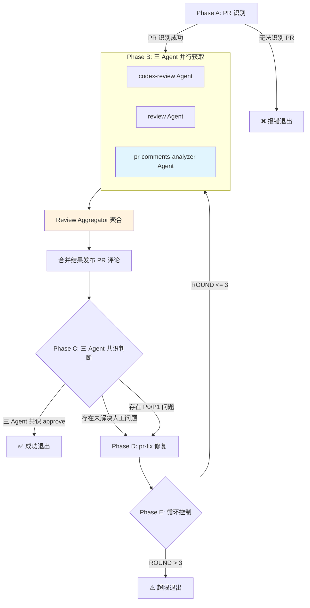

## Usage

```bash
# 自动识别当前分支对应的 PR
/pr-review-loop

# 显式指定 PR 编号
/pr-review-loop --pr <PR_NUMBER>

# 使用 nocodex 模式（pr-fix 直接执行修复，不委托 Codex CLI）
/pr-review-loop --nocodex
/pr-review-loop --pr <PR_NUMBER> --nocodex
```

## Multi-Agent 架构设计

### 🏗️ 架构模式：Supervisor/Orchestrator + 三源并行

```
                    ┌─────────────────────────────────────────────┐
                    │       Orchestrator (pr-review-loop)         │
                    │  - 流程控制、状态管理、三源聚合、结果发布      │
                    └───────────────────┬─────────────────────────┘
                                        │
        ┌───────────────────────────────┼───────────────────────────────┐
        │                               │                               │
        ▼                               ▼                               ▼
┌───────────────┐               ┌───────────────┐               ┌────────────────────┐
│  codex-review │               │    review     │               │ pr-comments-       │
│  (Agent)      │               │  (Agent)      │               │ analyzer (Agent)   │
│  代码规范评审  │               │  四维度评审    │               │ 人工评论线程分析    │
│               │               │               │               │                    │
└───────┬───────┘               └───────┬───────┘               └─────────┬──────────┘
        │                               │                               │
        │     ReviewResult              │     ReviewResult              │  PendingIssuesResult
        │     (JSON)                    │     (JSON)                    │  (结构化 JSON)
        │                               │                               │
        └───────────────────────────────┼───────────────────────────────┘
                                        │
                        ┌───────────────▼───────────────┐
                        │    Review Aggregator          │
                        │  - 直接拼接（不去重）          │
                        │  - 多源共识决策               │
                        └───────────────┬───────────────┘
                                        │
                        ┌───────────────▼───────────────┐
                        │      Structured Handoff       │
                        │  (聚合后 Findings → pr-fix)   │
                        └───────────────┬───────────────┘
                                        │
                        ┌───────────────▼───────────────┐
                        │         pr-fix Agent          │
                        │  - 按优先级修复               │
                        │  - 人工问题优先处理           │
                        │  - 提交并推送代码             │
                        └───────────────────────────────┘
```

### 🎯 设计原则（基于 Multi-Agent Patterns 最佳实践）

| 原则 | 实现 |
|------|------|
| **Context Isolation** | 每个 Agent 独立上下文窗口，避免互相污染 |
| **Structured Handoff** | 使用 JSON Schema 传递状态，避免 Telephone Game |
| **Parallel Execution** | codex-review + review + pr-comments-analyzer 三 Agent 并行执行 |
| **Priority Consensus** | 综合三源结论，按问题优先级决策（P0 > P1 > P2 > P3） |
| **Failure Isolation** | 单个来源失败不阻塞整体流程 |

### 🚨 角色边界（最高优先级）

**Orchestrator 只做协调，不做执行**

| 角色 | 职责 | 输出 | 何时使用 |
|------|------|------|----------|
| **Orchestrator** | 流程控制、聚合、发布 | — | 始终（入口） |
| **codex-review** | 代码规范评审（lint、style、naming） | ReviewResult JSON | 每轮评审 |
| **review** | 四维度评审（security、performance、quality、architecture） | ReviewResult JSON | 每轮评审 |
| **pr-comments-analyzer** | 人工评论线程分析、未解决问题提取 | PendingIssuesResult JSON | 每轮评审 |
| **pr-fix** | 执行代码修复 | FixResult JSON | 有 P0/P1 问题时 |

**⛔ 禁止行为**：
- ⛔ 直接修改源代码（使用 Edit/Write/MultiEdit）
- ⛔ 绕过 Agent 执行修复
- ⛔ 转述 Agent 输出时丢失关键信息（Telephone Game）

**✅ 允许行为**：
- ✅ 使用 Bash 执行 git/gh 命令
- ✅ 使用 Read/Glob/Grep 读取信息
- ✅ 使用 Task 调用 Agent（`run_in_background: true`）
- ✅ 使用 TaskOutput 收集结果
- ✅ 直接传递 Agent 结构化输出（避免转述）

### 核心目标

- 并行调用双 Agent 进行多维度评审（Context Isolation）
- 通过结构化输出传递状态（Structured Handoff）
- 统一权重共识决定最终结论（Priority-based Consensus）
- 自动化修复闭环，最多 3 轮迭代

### 技术约束

- 支持自动识别当前分支 PR
- 输出使用中文
- 所有修复必须通过 pr-fix Agent

---

## Structured Output Schema（结构化输出规范）

### 📋 评审结果 Schema

Agent 必须返回符合以下 JSON Schema 的结构化输出，避免 Telephone Game 问题：

```typescript
// 通用 Finding 结构（支持多源归因）
interface Finding {
  id: string;              // 唯一标识，如 "SEC-001", "HUMAN-001"
  priority: "P0" | "P1" | "P2" | "P3";
  category: "security" | "performance" | "quality" | "architecture" | "bug" | "testing" | "documentation" | "other";
  file: string;            // 文件路径
  line: number | null;     // 行号
  title: string;           // 问题标题
  description: string;     // 问题描述
  suggestion: string;      // 修复建议
  codeSnippet?: string;    // 代码示例
  // 多源归因字段
  source: {
    type: "agent" | "human";           // 来源类型
    name: string;                       // 来源名称（agent 名或 reviewer 用户名）
    reviewId?: string;                  // GitHub Review ID（仅 human 类型）
    timestamp: string;                  // 评审时间
  };
}

interface ReviewResult {
  // 元信息
  agent: "codex-review" | "review";
  prNumber: number;
  timestamp: string;

  // 核心结论
  conclusion: "approve" | "request_changes" | "needs_major_work";
  riskLevel: "high" | "medium" | "low";

  // 问题统计
  issues: {
    p0_blocking: number;    // 阻断问题
    p1_critical: number;    // 关键问题
    p2_important: number;   // 重要建议
    p3_suggestion: number;  // 优化建议
  };

  // 结构化问题列表（用于 Handoff 到 pr-fix）
  findings: Finding[];

  // 完整报告（Markdown 格式，用于发布评论）
  fullReport: string;
}
```

### 📋 人工评审结果 Schema（pr-comments-analyzer 输出）

由 `pr-comments-analyzer` Agent 分析 PR 评论线程后返回的结构化结果：

```typescript
// pr-comments-analyzer 返回的结构化结果
interface PendingIssuesResult {
  agent: "pr-comments-analyzer";
  prNumber: number;
  prTitle: string;
  prUrl: string;
  timestamp: string;  // ISO8601 格式

  // GitHub Review 状态（用于规则 0 检查）
  reviewState: {
    hasChangesRequested: boolean;           // 是否有 CHANGES_REQUESTED
    changesRequestedBy: Array<{             // 谁发起了 Request Changes
      login: string;
      association: "OWNER" | "MEMBER" | "COLLABORATOR" | "CONTRIBUTOR" | "NONE";
    }>;
  };

  // 线程统计
  stats: {
    totalThreads: number;
    resolvedThreads: number;
    unresolvedThreads: number;
    outdatedThreads: number;
  };

  // 问题统计
  issues: {
    p0_blocking: number;
    p1_critical: number;
    p2_important: number;
    p3_suggestion: number;
  };

  // 结构化问题列表（可直接用于 Handoff）
  pendingIssues: Array<{
    id: string;              // 唯一标识，如 "THREAD-001"
    threadId: string;        // GitHub thread ID
    priority: "P0" | "P1" | "P2" | "P3";
    category: "security" | "performance" | "quality" | "architecture" | "bug" | "testing" | "documentation" | "other";
    file: string;            // 文件路径
    line: number | null;     // 行号
    reviewer: string;        // 提出者
    title: string;           // 问题标题
    summary: string;         // 问题摘要
    originalComment: string; // 原始评论内容
    status: "unresolved" | "pending_confirmation" | "disputed";
    conversationSummary: string;  // 讨论摘要
    suggestedAction: string;      // 建议的处理方式
  }>;

  // 完整报告（Markdown 格式）
  fullReport: string;
}

// 转换为通用 Finding 格式（用于聚合）
function convertToFindings(result: PendingIssuesResult): Finding[] {
  return result.pendingIssues.map(issue => ({
    id: issue.id,
    priority: issue.priority,
    category: issue.category,
    file: issue.file,
    line: issue.line,
    title: issue.title,
    description: issue.summary,
    suggestion: issue.suggestedAction,
    source: {
      type: "human" as const,
      name: issue.reviewer,
      reviewId: issue.threadId,
      timestamp: result.timestamp
    }
  }));
}
```

### 📋 修复结果 Schema

```typescript
interface FixResult {
  agent: "pr-fix";
  prNumber: number;
  timestamp: string;

  // 修复统计
  summary: {
    fixed: number;      // 已修复数量
    rejected: number;   // 拒绝修复数量
    deferred: number;   // 延后处理数量
  };

  // 已修复问题
  fixedIssues: Array<{
    findingId: string;   // 对应 ReviewResult.findings[].id
    commitSha: string;   // 修复提交 SHA
    description: string; // 修复说明
  }>;

  // 拒绝/延后的问题
  rejectedIssues: Array<{
    findingId: string;
    reason: string;      // 拒绝/延后理由
  }>;

  // 提交信息
  commits: Array<{
    sha: string;
    message: string;
  }>;
}
```

### 🔄 Priority Consensus 算法（多源版本）

支持三源评审聚合：codex-review Agent、review Agent、GitHub 评审。

#### 设计原则：KISS - 统一权重

所有评审来源权重相同，仅按问题优先级决策。

#### 冲突裁决表

| 优先级 | 条件 | 结论 | 说明 |
|--------|------|------|------|
| 0 | CHANGES_REQUESTED (OWNER/MEMBER/COLLABORATOR) | request_changes | 人工否决权 |
| 1 | 任一来源 P0 > 0 | needs_major_work | 阻断问题 |
| 2 | 任一来源 P1 > 0 | request_changes | 关键问题 |
| 3 | P2 >= 3 | request_changes | 重要问题累积 |
| 4 | 其他 | approve | 可接受 |

#### 决策算法（多源版本）

```python
from typing import List, Optional


def has_changes_requested_by_privileged(comments_analysis: PendingIssuesResult) -> bool:
    """
    规则 0: 检查是否有 OWNER/MEMBER/COLLABORATOR 发起的 CHANGES_REQUESTED

    这是人工否决权，优先级最高，即使没有具体评论线程也必须阻止合并。
    """
    if not comments_analysis or not comments_analysis.reviewState.hasChangesRequested:
        return False

    privileged_associations = {"OWNER", "MEMBER", "COLLABORATOR"}
    for reviewer in comments_analysis.reviewState.changesRequestedBy:
        if reviewer.association in privileged_associations:
            return True
    return False


def consensus_multi_source(
    pr_review: Optional[ReviewResult],
    review: Optional[ReviewResult],
    comments_analysis: Optional[PendingIssuesResult]
) -> tuple[str, List[Finding]]:
    """
    多源共识算法（简化版 - 不去重，直接拼接）

    决策优先级：
    - 规则 0: CHANGES_REQUESTED (OWNER/MEMBER/COLLABORATOR) → request_changes（人工否决权）
    - 规则 1: 任一来源 P0 > 0 → needs_major_work
    - 规则 2: 任一来源 P1 > 0 → request_changes
    - 规则 3: P2 >= 3 → request_changes
    - 规则 4: 其他 → approve
    """
    all_findings: List[Finding] = []

    if pr_review:
        all_findings.extend(pr_review.findings)
    if review:
        all_findings.extend(review.findings)
    if comments_analysis:
        # 将 pr-comments-analyzer 的输出转换为 Finding 格式
        all_findings.extend(convertToFindings(comments_analysis))

    # 规则 0: 人工否决权（最高优先级）
    # 即使没有具体评论线程，CHANGES_REQUESTED 也必须阻止合并
    if has_changes_requested_by_privileged(comments_analysis):
        return "request_changes", all_findings

    # 按优先级计数（不去重 - 重复报告说明问题确实存在）
    p0 = sum(1 for f in all_findings if f.priority == "P0")
    p1 = sum(1 for f in all_findings if f.priority == "P1")
    p2 = sum(1 for f in all_findings if f.priority == "P2")

    # 规则 1-4
    if p0 > 0:
        return "needs_major_work", all_findings
    if p1 > 0:
        return "request_changes", all_findings
    if p2 >= 3:
        return "request_changes", all_findings

    return "approve", all_findings


def has_unresolved_human_issues(comments_analysis: PendingIssuesResult) -> bool:
    """
    检查是否有未解决的人工问题
    """
    return comments_analysis.stats.unresolvedThreads > 0


def has_blocking_human_issues(comments_analysis: PendingIssuesResult) -> bool:
    """
    检查是否有阻断性人工问题（P0）
    """
    return comments_analysis.issues.p0_blocking > 0
```

#### 风险等级计算

```python
def calculate_risk_level(findings: List[Finding]) -> str:
    """
    风险等级基于问题严重程度

    高风险: P0 > 0 或 P1 >= 2
    中风险: P1 == 1 或 P2 >= 3
    低风险: 其他
    """
    p0 = sum(1 for f in findings if f.priority == "P0")
    p1 = sum(1 for f in findings if f.priority == "P1")
    p2 = sum(1 for f in findings if f.priority == "P2")

    if p0 > 0 or p1 >= 2:
        return "high"
    if p1 == 1 or p2 >= 3:
        return "medium"
    return "low"
```

**设计原则（KISS）：**
- **不去重**: 重复报告说明问题确实存在，保留所有 Findings
- **统一权重**: 所有来源权重相同，按问题优先级决策

---

## 工作流阶段

### Phase A：参数解析与 PR 识别

#### A.1 解析输入

1. 接受 `--pr <PR_NUMBER>` 或 `<PR_URL>`
   - 若提供：解析出 `pr_number`，直接使用

2. 检查是否指定 `--nocodex` 标志
   - 若提供：设置 `USE_NOCODEX = true`，pr-fix 将直接执行修复
   - 若未提供：设置 `USE_NOCODEX = false`，pr-fix 将委托 Codex CLI

3. 若未提供 `--pr`，自动识别当前分支对应的 PR：
   ```bash
   # 获取当前分支名
   git branch --show-current

   # 查找当前分支关联的 PR
   gh pr list --head <BRANCH> --json number,title,url
   ```
   - 若找到唯一 PR：使用该 PR
   - 若找到多个 PR：提示用户选择
   - 若未找到 PR：报错退出
     ```
     ❌ 错误：当前分支没有关联的 PR

     请先创建 PR：gh pr create
     或显式指定：/pr-review-loop --pr <PR_NUMBER>
     ```

#### A.2 初始化循环控制

- 设置 `ROUND = 1`
- 设置 `MAX_ROUNDS = 3`
- 设置 `USE_NOCODEX`（来自参数解析）
- 初始化 `REVIEW_HISTORY = []`

---

### Phase B：三源并行评审（Context Isolation + Parallel Execution）

> 循环入口点 - Agent 独立上下文 + GitHub 人工评审，三源并行执行

#### B.1 输出当前轮次

```
🔄 第 ${ROUND}/${MAX_ROUNDS} 轮评审开始...

📊 三 Agent 并行调度：
├── codex-review Agent（代码规范评审）
├── review Agent（四维度深度评审）
└── pr-comments-analyzer Agent（人工评论线程分析）
```

#### B.2 三 Agent 并行获取（Parallel Execution）

**⚠️ 关键：单条消息同时发起三个 Agent Task，实现真正的并行执行**

```
┌─────────────────────────────────────────────────────────────┐
│                    单条消息三 Agent 并行调用                  │
├─────────────────────────────────────────────────────────────┤
│  操作 1 (codex-review Agent):                                  │
│  - subagent_type: "codex-review"                               │
│  - run_in_background: true                                  │
│  - prompt: 包含 PR 编号和结构化输出要求                       │
│                                                             │
│  操作 2 (review Agent):                                     │
│  - subagent_type: "review"                                  │
│  - run_in_background: true                                  │
│  - prompt: 包含 PR 编号和结构化输出要求                       │
│                                                             │
│  操作 3 (pr-comments-analyzer Agent):                       │
│  - subagent_type: "pr-comments-analyzer"                    │
│  - run_in_background: true                                  │
│  - prompt: 包含 PR 编号，分析评论线程                         │
└─────────────────────────────────────────────────────────────┘
                              │
                              ▼
┌─────────────────────────────────────────────────────────────┐
│                    并行收集结果                              │
├─────────────────────────────────────────────────────────────┤
│  TaskOutput (codex-review): block: true                        │
│  TaskOutput (review): block: true                           │
│  TaskOutput (pr-comments-analyzer): block: true             │
└─────────────────────────────────────────────────────────────┘
```

**pr-comments-analyzer Agent 的职责**：
- ✅ 获取 PR 的所有评论线程（reviews + review comments + issue comments）
- ✅ 分析线程解决状态（resolved/outdated/unresolved）
- ✅ 提取未解决问题并按 P0-P3 优先级分类
- ✅ 返回结构化 `PendingIssuesResult` JSON

**Agent 调用 Prompt 模板**：

```
## codex-review Agent Prompt

请对 PR #${PR_NUMBER} 进行代码评审。

**输出要求**：必须返回符合 ReviewResult Schema 的 JSON 结构

{
  "agent": "codex-review",
  "prNumber": ${PR_NUMBER},
  "conclusion": "approve" | "request_changes" | "needs_major_work",
  "riskLevel": "high" | "medium" | "low",
  "issues": { "p0_blocking": 0, "p1_critical": 0, ... },
  "findings": [...],  // 每个 finding 必须包含 source 字段
  "fullReport": "完整 Markdown 报告"
}

## review Agent Prompt

请对 PR #${PR_NUMBER} 进行四维度代码评审。

**输出要求**：必须返回符合 ReviewResult Schema 的 JSON 结构
（同上）

## pr-comments-analyzer Agent Prompt

请分析 PR #${PR_NUMBER} 的评论线程，提取未解决的问题。

**输出要求**：必须返回符合 PendingIssuesResult Schema 的 JSON 结构

{
  "agent": "pr-comments-analyzer",
  "prNumber": ${PR_NUMBER},
  "stats": { "totalThreads": 0, "resolvedThreads": 0, ... },
  "issues": { "p0_blocking": 0, "p1_critical": 0, ... },
  "pendingIssues": [...],
  "fullReport": "完整 Markdown 报告"
}
```

**⛔ 禁止模式（串行执行）**：
```
❌ Task(codex-review) → 等待 → Task(review) → 等待 → Task(pr-comments-analyzer)
```

**✅ 正确模式（并行执行）**：
```
✅ [Task(codex-review), Task(review), Task(pr-comments-analyzer)]
   → 同时启动三个 Agent → 并行收集结果
```

#### B.3 三源结果解析与共识决策

**B.3.1 解析所有来源的结构化结果**

```typescript
// 三个 Agent 结果解析
const codexReviewResult: ReviewResult = JSON.parse(prReviewOutput);
const reviewResult: ReviewResult = JSON.parse(reviewOutput);
const commentsAnalysis: PendingIssuesResult = JSON.parse(commentsAnalyzerOutput);

// 将 pr-comments-analyzer 的输出转换为 Finding 格式
const humanFindings: Finding[] = convertToFindings(commentsAnalysis);
```

**B.3.2 应用 Priority Consensus 算法**

```
决策规则（按优先级从高到低）：

┌─────────────────────────────────────────────────────────────────┐
│ 规则 1: 存在未解决的 P0 人工问题  → needs_major_work (阻断问题)   │
│ 规则 2: 任一来源 P0 > 0         → needs_major_work (阻断问题)    │
│ 规则 3: 任一来源 P1 > 0         → request_changes (关键问题)     │
│ 规则 4: P2 >= 3                 → request_changes (重要问题)     │
│ 规则 5: 其他情况                → approve (可接受)               │
└─────────────────────────────────────────────────────────────────┘

冲突裁决：严格结论优先
- 人工评论中的 P0 问题会阻止合并
- 任一来源 needs_major_work → needs_major_work
- 任一来源 request_changes → request_changes
```

**B.3.3 汇总评审结果表（三 Agent 版本）**

| 来源 | 结论 | P0 | P1 | P2 | P3 |
|------|------|----|----|----|----|
| codex-review | ${codexReviewResult.conclusion} | X | Y | Z | W |
| review | ${reviewResult.conclusion} | X | Y | Z | W |
| pr-comments-analyzer | — | A | B | C | D |
| **聚合** | ${consensusConclusion} | — | — | — | — |

**人工评论统计**：
- 总线程数：${commentsAnalysis.stats.totalThreads}
- 已解决：${commentsAnalysis.stats.resolvedThreads}
- 未解决：${commentsAnalysis.stats.unresolvedThreads}

将本轮结果追加到 `REVIEW_HISTORY`。

#### B.4 合并评审结果并发布评论（三 Agent 版本）

**关键：直接使用各 Agent 的 fullReport，避免 Telephone Game**

```bash
# 使用 heredoc 发布合并报告
# ⚠️ 必须包含 marker 便于后续过滤
gh pr comment ${PR_NUMBER} --body-file - <<'EOF'
<!-- pr-review-loop-marker -->
## 🔍 PR 综合评审报告 - 第 ${ROUND} 轮

### 📊 三 Agent 评审摘要

| 来源 | 结论 | P0 | P1 | P2 | P3 |
|------|------|----|----|----|----|
| codex-review | ${codexReviewConclusion} | X | Y | Z | W |
| review | ${reviewConclusion} | X | Y | Z | W |
| pr-comments-analyzer | — | A | B | C | D |

**🎯 综合结论**: ${consensusConclusion}
**📈 风险等级**: ${riskLevel}

---

### 👥 人工评论分析

**线程统计**：
- 总线程数：${commentsAnalysis.stats.totalThreads}
- 已解决：${commentsAnalysis.stats.resolvedThreads}
- 未解决：${commentsAnalysis.stats.unresolvedThreads}
- 已过时：${commentsAnalysis.stats.outdatedThreads}

---

### ⛔ 阻断问题 (P0) - ${p0Count} 个
${mergedP0Findings}

### 🔴 关键问题 (P1) - ${p1Count} 个
${mergedP1Findings}

### 🟡 重要建议 (P2) - ${p2Count} 个
${mergedP2Findings}

### 🟢 优化建议 (P3) - ${p3Count} 个
${mergedP3Findings}

---

<details>
<summary>📄 codex-review Agent 完整报告</summary>

${codexReviewResult.fullReport}
</details>

<details>
<summary>📄 review Agent 完整报告</summary>

${reviewResult.fullReport}
</details>

<details>
<summary>👥 pr-comments-analyzer Agent 完整报告</summary>

${commentsAnalysis.fullReport}
</details>
EOF
```

**⚠️ 避免 Telephone Game**：
- ✅ 直接嵌入各 Agent 的 `fullReport`，不做转述
- ✅ 问题列表从聚合后的 `findings` 数组直接提取
- ⛔ 禁止用自己的话"总结" Agent 输出

---

### Phase C：评审结果判断（三 Agent 版本）

#### C.1 判断是否可直接合并

**合并条件**（多源共识）：

```python
def can_merge(consensus: str, findings: List[Finding], comments_analysis: PendingIssuesResult) -> bool:
    """
    合并条件（按优先级检查）：
    1. 存在未解决的人工问题 → 禁止（需先解决）
    2. P0 > 0 → 禁止
    3. P1 > 0 → 禁止
    4. P2 > 0 → 禁止
    5. consensus == "approve" → 允许
    """
    # 存在未解决的人工问题
    if comments_analysis.stats.unresolvedThreads > 0:
        return False

    p0 = sum(1 for f in findings if f.priority == "P0")
    p1 = sum(1 for f in findings if f.priority == "P1")
    p2 = sum(1 for f in findings if f.priority == "P2")

    if p0 > 0 or p1 > 0 or p2 > 0:
        return False

    return consensus == "approve"


if can_merge(consensusConclusion, allFindings, commentsAnalysis):
    → 跳转 Phase E（成功退出）
else:
    → 继续 Phase D（修复流程）
```

#### C.2 输出判断结果

- 若可合并：
  ```
  ✅ 三 Agent 评审通过，PR 可合并

  - Agent 评审: 双 Agent 建议合并
  - 人工评论: 无未解决问题
  - 问题统计: P0=0, P1=0, P2=0, P3=${p3Count}
  ```

- 若需修复：
  ```
  ⚠️ 存在需要修复的问题，启动自动修复流程...

  来源分析:
  - codex-review Agent: ${codexReviewConclusion}
  - review Agent: ${reviewConclusion}
  - pr-comments-analyzer: ${commentsAnalysis.stats.unresolvedThreads} 个未解决线程

  待修复问题: ${allFindings.length} 个
  - P0 (阻断): ${p0Count}
  - P1 (关键): ${p1Count}
  - P2 (重要): ${p2Count} （所有 P0-P2 问题将自动修复）
  ```

---

### Phase D：自动修复（Structured Handoff + Failure Isolation）

> 🚨 **关键约束**：Orchestrator 只做状态传递，不做代码修改

#### D.0 记录基准状态（强制）

```bash
# 记录当前提交数量和最新 SHA
BEFORE_COMMITS=$(gh pr view <PR_NUMBER> --json commits --jq '.commits | length')
BEFORE_SHA=$(gh pr view <PR_NUMBER> --json commits --jq '.commits[-1].oid')
echo "📍 基准状态: commits=$BEFORE_COMMITS, latest_sha=$BEFORE_SHA"
```

#### D.1 构建 Structured Handoff Payload（三 Agent 聚合版本）

**关键：将三 Agent 聚合后的评审结果结构化传递给 pr-fix，避免重复获取**

从 Phase B 的 `allFindings` 数组中提取需要修复的问题：

```typescript
// 使用聚合后的 findings（来自 consensus_multi_source）
const fixPayload = {
  prNumber: PR_NUMBER,
  round: ROUND,

  // 必须修复的问题（P0 + P1 + P2）
  issuesToFix: allFindings
    .filter(f => f.priority === "P0" || f.priority === "P1" || f.priority === "P2")
    .map(f => ({
      id: f.id,
      priority: f.priority,
      category: f.category,
      file: f.file,
      line: f.line,
      title: f.title,
      description: f.description,
      suggestion: f.suggestion,
      // 保留来源信息，便于 pr-fix 决策
      source: {
        type: f.source.type,          // "agent" | "human"
        name: f.source.name,          // agent 名或 reviewer 用户名
        reviewId: f.source.reviewId,  // GitHub thread ID（仅 human 类型）
        timestamp: f.source.timestamp
      }
    })),

  // 可选修复的问题（P3）
  optionalIssues: allFindings
    .filter(f => f.priority === "P3")
    .map(f => ({
      id: f.id,
      priority: f.priority,
      category: f.category,
      file: f.file,
      line: f.line,
      title: f.title,
      description: f.description,
      suggestion: f.suggestion,
      source: f.source
    })),

  // 人工评论状态摘要（供 pr-fix 参考）
  commentsStatus: {
    totalThreads: commentsAnalysis.stats.totalThreads,
    unresolvedThreads: commentsAnalysis.stats.unresolvedThreads,
    hasBlockingIssues: commentsAnalysis.issues.p0_blocking > 0
  }
};
```

**来源归因的价值**：
- 修复后可针对性回复 GitHub 评论（通过 threadId）
- 便于追踪每个问题的修复状态
- 区分 Agent 发现的问题和人工提出的问题

#### D.2 调用 pr-fix Agent（Structured Handoff）

**使用结构化 Payload 调用 pr-fix Agent**：

```
Task 调用:
- subagent_type: "pr-fix"
- description: "修复 PR #${PR_NUMBER} 评审问题"
- prompt: |
    请修复 PR #${PR_NUMBER} 中的评审问题。

    ${USE_NOCODEX ? "nocodex" : ""}

    ## 问题列表（Structured Handoff）

    以下问题需要修复：

    ${JSON.stringify(fixPayload, null, 2)}

    ## 输出要求

    必须返回符合 FixResult Schema 的 JSON 结构：

    {
      "agent": "pr-fix",
      "prNumber": ${PR_NUMBER},
      "summary": { "fixed": 0, "rejected": 0, "deferred": 0 },
      "fixedIssues": [...],
      "rejectedIssues": [...],
      "commits": [...]
    }

    ## 修复原则

    1. 优先修复 P0 > P1 > P2 > P3
    2. 对于无法修复的问题，记录拒绝理由
    3. 每个修复对应 fixPayload.issuesToFix[].id
```

**执行模式说明**：

| 模式 | 条件 | pr-fix 行为 |
|------|------|-------------|
| **默认模式** | `USE_NOCODEX = false` | pr-fix 委托 Codex CLI 执行修复 |
| **nocodex 模式** | `USE_NOCODEX = true` | pr-fix 直接执行修复，减少代理层开销 |

**nocodex 模式适用场景**：
- 问题简单明确、修复建议具体
- 需要减少 token 消耗和执行时间
- 不需要复杂推理的修复任务

**⛔ 禁止行为**：
- ⛔ Orchestrator 直接使用 Edit/Write 修改代码
- ⛔ 跳过 pr-fix Agent 直接修复"简单问题"
- ⛔ 不传递结构化 Payload，让 pr-fix 重新获取评审意见

#### D.3 解析修复结果

```javascript
const fixResult = JSON.parse(prFixOutput);

console.log(`
📊 修复统计:
├── ✅ 已修复: ${fixResult.summary.fixed}
├── ⛔ 拒绝: ${fixResult.summary.rejected}
└── ⏳ 延后: ${fixResult.summary.deferred}
`);
```

#### D.4 修复后验证（Failure Isolation）

**必须验证修复是否生效**：

```bash
AFTER_COMMITS=$(gh pr view <PR_NUMBER> --json commits --jq '.commits | length')
AFTER_SHA=$(gh pr view <PR_NUMBER> --json commits --jq '.commits[-1].oid')
```

**验证逻辑**：

```
┌──────────────────────────────────────────────────────────────┐
│                       验证修复有效性                          │
├──────────────────────────────────────────────────────────────┤
│ 条件 A: AFTER_COMMITS > BEFORE_COMMITS (新增 commit)         │
│ 条件 B: AFTER_SHA != BEFORE_SHA (amend 修复)                 │
│ 条件 C: fixResult.summary.fixed > 0                          │
├──────────────────────────────────────────────────────────────┤
│ 满足 (A || B) && C → ✅ 修复成功，继续 Phase E               │
│ 满足 (A || B) && !C → ⚠️ 提交存在但无有效修复                 │
│ !(A || B) → ❌ 验证失败，修复未提交                          │
└──────────────────────────────────────────────────────────────┘
```

**错误恢复策略（Failure Isolation）**：

| 失败类型 | 处理策略 |
|----------|----------|
| pr-fix Agent 超时 | 记录失败，继续下一轮评审 |
| pr-fix 未提交代码 | 记录原因，继续下一轮评审 |
| pr-fix 返回格式错误 | 尝试解析文本，降级处理 |

```
如果修复失败:
  记录到 REVIEW_HISTORY[ROUND].fixFailure = { reason, details }
  继续 Phase E（循环控制）
```

---

### Phase E：循环控制与退出

#### E.1 检查循环次数

```python
ROUND += 1

if ROUND > MAX_ROUNDS:
    → 跳转 Phase F（超限退出）
else:
    → 返回 Phase B（继续下一轮）
```

#### E.2 成功退出（三源评审通过）

```
✅ PR 评审-修复流程完成

## 执行摘要

- PR 编号：#<PR_NUMBER>
- 总轮次：${ROUND} 轮
- 最终结果：✅ 三源评审通过

## 三源评审状态

| 来源 | 类型 | 最终结论 |
|------|------|----------|
| codex-review | Agent | ${codexReviewConclusion} |
| review | Agent | ${reviewConclusion} |
| GitHub 人工 | Human | ${humanState} |

## 轮次历史

| 轮次 | codex-review | review | 人工状态 | 修复数 |
|------|-----------|--------|----------|--------|
| 1    | ...       | ...    | ...      | X      |
| 2    | ...       | ...    | ...      | Y      |
| ...  | ...       | ...    | ...      | ...    |

## 后续动作

- [ ] 确认评审评论已发布到 PR
- [ ] 确认 GitHub 评审已全部 Resolve
- [ ] 可执行合并操作
```

---

### Phase F：超限退出

当达到最大轮次仍未通过时：

```
⚠️ PR 评审-修复流程达到最大轮次限制

## 执行摘要

- PR 编号：#<PR_NUMBER>
- 已执行轮次：${MAX_ROUNDS} 轮
- 最终结果：⚠️ 未完全收敛

## 轮次历史

| 轮次 | codex-review 结论 | review 结论 | 修复数 |
|------|---------------|-------------|--------|
| 1    | ...           | ...         | X      |
| 2    | ...           | ...         | Y      |
| 3    | ...           | ...         | Z      |

## 剩余问题

<列出最后一轮仍存在的问题>

## 后续动作

- [ ] 人工审查剩余问题
- [ ] 手动修复后重新运行 `/pr-review-loop --pr <PR_NUMBER>`
- [ ] 或接受当前状态并手动合并
```

---

## 流程图（三 Agent 版本）



---

## Agent 调用规范（Structured Output 版本）

### codex-review Agent

```
请对 PR #${PR_NUMBER} 进行代码评审。

## 评审流程
1. 获取 PR diff：`gh pr diff ${PR_NUMBER}`
2. 阅读历史评论：`gh pr view ${PR_NUMBER} --comments`
3. 按照 @.claude/codex_prompt.txt 标准进行评审
4. 生成结构化评审报告

## 输出格式（必须遵循 ReviewResult Schema）

\`\`\`json
{
  "agent": "codex-review",
  "prNumber": ${PR_NUMBER},
  "timestamp": "ISO8601",
  "conclusion": "approve" | "request_changes" | "needs_major_work",
  "riskLevel": "high" | "medium" | "low",
  "issues": {
    "p0_blocking": 0,
    "p1_critical": 0,
    "p2_important": 0,
    "p3_suggestion": 0
  },
  "findings": [
    {
      "id": "CODE-001",
      "priority": "P1",
      "category": "quality",
      "file": "src/example.ts",
      "line": 42,
      "title": "问题标题",
      "description": "问题描述",
      "suggestion": "修复建议"
    }
  ],
  "fullReport": "完整 Markdown 评审报告"
}
\`\`\`

## 注意事项
- 不发布评论到 GitHub（由 Orchestrator 统一发布）
- 必须返回 JSON 格式，fullReport 包含完整 Markdown
```

### review Agent

```
请对 PR #${PR_NUMBER} 进行四维度代码评审。

## 评审维度
1. **Quality** - 代码质量、可读性、可维护性
2. **Security** - 安全漏洞、最佳实践
3. **Performance** - 效率、优化机会
4. **Architecture** - 设计模式、结构决策

## 评审流程
1. 获取 PR diff：`gh pr diff ${PR_NUMBER}`
2. 获取变更文件列表：`gh pr view ${PR_NUMBER} --json files`
3. 按四维度分析代码变更
4. 生成结构化评审报告

## 输出格式（必须遵循 ReviewResult Schema）

\`\`\`json
{
  "agent": "review",
  "prNumber": ${PR_NUMBER},
  "timestamp": "ISO8601",
  "conclusion": "approve" | "request_changes" | "needs_major_work",
  "riskLevel": "high" | "medium" | "low",
  "issues": {
    "p0_blocking": 0,
    "p1_critical": 0,
    "p2_important": 0,
    "p3_suggestion": 0
  },
  "findings": [
    {
      "id": "SEC-001",
      "priority": "P0",
      "category": "security",
      "file": "src/auth.ts",
      "line": 100,
      "title": "SQL 注入风险",
      "description": "用户输入未经转义直接拼接 SQL",
      "suggestion": "使用参数化查询"
    }
  ],
  "fullReport": "完整 Markdown 评审报告"
}
\`\`\`

## 注意事项
- 不发布评论到 GitHub（由 Orchestrator 统一发布）
- 必须返回 JSON 格式，fullReport 包含完整 Markdown
```

### pr-comments-analyzer Agent

```
请分析 PR #${PR_NUMBER} 的评论线程，提取未解决的问题。

## 分析流程
1. 获取 PR reviews：`gh api repos/{owner}/{repo}/pulls/${PR_NUMBER}/reviews`
2. 获取行级评论：`gh api repos/{owner}/{repo}/pulls/${PR_NUMBER}/comments`
3. 获取 review threads（含解决状态）：使用 GraphQL API
4. 分析线程解决状态
5. 提取未解决问题并按优先级分类

## 输出格式（必须遵循 PendingIssuesResult Schema）

\`\`\`json
{
  "agent": "pr-comments-analyzer",
  "prNumber": ${PR_NUMBER},
  "prTitle": "PR 标题",
  "prUrl": "https://github.com/...",
  "timestamp": "ISO8601",
  "stats": {
    "totalThreads": 10,
    "resolvedThreads": 7,
    "unresolvedThreads": 3,
    "outdatedThreads": 0
  },
  "issues": {
    "p0_blocking": 1,
    "p1_critical": 1,
    "p2_important": 1,
    "p3_suggestion": 0
  },
  "pendingIssues": [
    {
      "id": "THREAD-001",
      "threadId": "PRRT_kwDOABC123",
      "priority": "P0",
      "category": "security",
      "file": "src/auth.ts",
      "line": 42,
      "reviewer": "security-reviewer",
      "title": "JWT secret 硬编码",
      "summary": "JWT 签名密钥直接写在代码中",
      "originalComment": "This JWT secret should not be hardcoded.",
      "status": "unresolved",
      "conversationSummary": "Reviewer 指出安全问题，作者尚未回复",
      "suggestedAction": "将 JWT_SECRET 移至环境变量"
    }
  ],
  "fullReport": "完整 Markdown 报告"
}
\`\`\`

## 注意事项
- 不修改 PR 或发布评论（由 Orchestrator 统一发布）
- 必须返回 JSON 格式，fullReport 包含完整 Markdown
- 准确判断线程解决状态（isResolved/isOutdated）
```

### pr-fix Agent

```
请修复 PR #${PR_NUMBER} 中的评审问题。

${USE_NOCODEX ? "nocodex" : ""}

## 问题列表（Structured Handoff）

${JSON.stringify(fixPayload, null, 2)}

## 修复流程
1. 解析 issuesToFix 数组中的问题
2. 按 priority 排序：P0 > P1 > P2 > P3
3. 逐个实施修复
4. 提交代码：`git add -A && git commit -m "fix(pr #${PR_NUMBER}): ..." && git push`
5. 生成结构化修复报告

## 输出格式（必须遵循 FixResult Schema）

\`\`\`json
{
  "agent": "pr-fix",
  "prNumber": ${PR_NUMBER},
  "timestamp": "ISO8601",
  "summary": {
    "fixed": 3,
    "rejected": 1,
    "deferred": 0
  },
  "fixedIssues": [
    {
      "findingId": "SEC-001",
      "commitSha": "abc123",
      "description": "已使用参数化查询修复 SQL 注入"
    }
  ],
  "rejectedIssues": [
    {
      "findingId": "PERF-002",
      "reason": "需要架构层面重构，超出本 PR 范围"
    }
  ],
  "commits": [
    {
      "sha": "abc123",
      "message": "fix(pr #123): 修复 SQL 注入和输入校验问题"
    }
  ]
}
\`\`\`

## 修复原则
- 必须修复 issuesToFix 中的所有 P0、P1、P2 问题
- P3 问题（optionalIssues）可选择性修复
- 不引入无关变更
- 对无法修复的问题，记录 rejectedIssues 并说明理由
- 每个 fixedIssue 必须关联 findingId

## 执行模式
- **默认模式**：pr-fix 委托 Codex CLI 执行修复（适合复杂问题）
- **nocodex 模式**：当 prompt 中包含 "nocodex" 时，pr-fix 直接执行修复（适合简单明确的修复）
```

---

## Key Constraints

### 🚨 角色边界（最高优先级）

- **Orchestrator 禁止直接修改代码** — 所有代码修复必须通过 pr-fix Agent
- **禁止使用 Edit/Write/MultiEdit** — 这些工具仅限 Agent 使用
- **无论问题多简单，都必须调用 Agent** — 不存在"太简单不需要 Agent"的情况
- **违反角色边界视为流程失败** — 即使修复成功，也必须回滚并重新通过 Agent 执行

### PR 识别

- 支持 `--pr <PR_NUMBER>` 显式指定
- 若未提供 `--pr`，自动识别当前分支关联的 PR
- 若无法识别 PR（当前分支无关联 PR），报错退出

### 循环控制

- 最多执行 3 轮评审-修复循环
- 每轮都会完整执行三源评审（Agent × 2 + GitHub）
- 仅当三源共识为 "approve" 且无 P0/P1 问题时退出循环
- CHANGES_REQUESTED (OWNER/MEMBER/COLLABORATOR) 会阻止合并

### Agent 调用

- Phase B 的评审获取必须**并行**执行：
  - 三个 Agent Task 并行启动（codex-review + review + pr-comments-analyzer）
  - 使用 `run_in_background: true` 实现真正并行
- Phase D 的 pr-fix Agent **必须通过 Task 工具调用**，禁止绕过
- 每个 Agent 的结果需等待完成后再进行聚合
- **Agent 调用是强制性的**，不是可选的

### nocodex 模式

- 通过 `--nocodex` 参数启用
- 启用后，pr-fix Agent 将直接执行修复，而非委托 Codex CLI
- **适用场景**：问题简单明确、修复建议具体、不需要复杂推理
- **优势**：减少 Context Isolation 开销、避免 Telephone Game、降低 token 消耗（约 15×）
- **参数传递**：Orchestrator 在调用 pr-fix 时需在 prompt 中包含 "nocodex" 关键字

### 人工评论处理

- 每轮循环由 pr-comments-analyzer Agent 分析 PR 评论线程
- pr-comments-analyzer 负责：获取评论、分析线程状态、提取未解决问题、按优先级分类
- 未解决的人工问题会阻止合并
- 修复后应针对性回复 GitHub 评论（可选）

### 评论发布标记

- Orchestrator 发布的所有 PR 评论必须包含 `<!-- pr-review-loop-marker -->` 标记
- 此标记用于区分 Agent 生成的评论与人工评论
- pr-comments-analyzer 在分析时应过滤包含此标记的内容

### 输出要求

- 全程使用中文输出
- 每轮开始时输出当前轮次和三源调度计划
- 聚合结果表需包含问题统计
- 退出时输出完整的执行摘要

---

## Success Criteria

- ✅ 正确识别 PR（通过参数或自动识别当前分支）
- ✅ 三 Agent 并行获取：codex-review Agent + review Agent + pr-comments-analyzer Agent
- ✅ pr-comments-analyzer 正确分析评论线程并提取未解决问题
- ✅ 多源聚合：直接拼接所有 Findings（不去重）
- ✅ 三 Agent 共识：按问题优先级决策（P0 > P1 > P2 > P3）
- ✅ 合并评审结果并发布到 PR 评论
- ✅ 正确判断三 Agent 结果，未解决人工问题会阻止合并
- ✅ 调用 pr-fix 执行自动修复（传递聚合后的 Findings）
- ✅ 循环控制正确，最多 3 轮
- ✅ 输出清晰的执行摘要与后续动作建议

---

## 示例场景

### 1. 三 Agent 评审首轮通过（无人工评论）

```bash
/pr-review-loop

→ 识别当前分支：feat/add-user-auth
→ 查找关联 PR：#123

🔄 第 1/3 轮评审开始...

📊 三 Agent 并行调度：
├── codex-review Agent（代码规范评审）
├── review Agent（四维度深度评审）
└── pr-comments-analyzer Agent（人工评论线程分析）

→ codex-review 结论：approve（P0=0, P1=0, P2=1）
→ review 结论：approve（P0=0, P1=0, P2=2）
→ pr-comments-analyzer：无未解决评论线程
→ 聚合后问题：3 个 P2，0 个 P0/P1
→ 三 Agent 共识：approve

✅ 三 Agent 评审通过，PR 可合并

✅ PR 评审-修复流程完成
- 总轮次：1 轮
- 最终结果：✅ 三 Agent 评审通过
```

### 2. 人工评论提出问题，经过 2 轮修复后通过

```bash
/pr-review-loop --pr 456

🔄 第 1/3 轮评审开始...

📊 三 Agent 并行调度：
├── codex-review Agent
├── review Agent
└── pr-comments-analyzer Agent

→ codex-review 结论：approve（P0=0, P1=1, P2=2）
→ review 结论：request_changes（P0=0, P1=2, P2=1）
→ pr-comments-analyzer：
  ├── 总线程数：5
  ├── 已解决：2
  └── 未解决：3（→ 转换为 THREAD-001~003）
      ├── THREAD-001 (P1): @senior-dev 指出 N+1 查询问题
      ├── THREAD-002 (P2): @reviewer 建议优化命名
      └── THREAD-003 (P2): @reviewer 建议添加注释

→ 聚合后问题：6 个（P1=3 来自 Agent, P2=3 来自人工+Agent）
→ 三 Agent 共识：request_changes（存在 P1 问题）

⚠️ 存在需要修复的问题，启动自动修复流程...
→ 传递聚合后 Findings 到 pr-fix Agent
→ pr-fix 修复 5 个问题，拒绝 1 个（需架构调整）

🔄 第 2/3 轮评审开始...

→ codex-review 结论：approve
→ review 结论：approve
→ pr-comments-analyzer：
  ├── 总线程数：5
  ├── 已解决：5（作者已回复，问题已处理）
  └── 未解决：0

→ 三 Agent 共识：approve

✅ 三 Agent 评审通过，PR 可合并

✅ PR 评审-修复流程完成
- 总轮次：2 轮
- 最终结果：✅ 三 Agent 评审通过（人工评论已解决）
```

### 3. 人工评论持续未解决导致超限退出

```bash
/pr-review-loop --pr 789

🔄 第 1/3 轮评审开始...
→ Agent 评审通过
→ pr-comments-analyzer：
  └── 1 个未解决（P0）：@tech-lead 要求重新设计架构
→ 三 Agent 共识：needs_major_work（存在 P0 问题）
→ pr-fix 尝试修复...（架构问题无法自动修复）

🔄 第 2/3 轮评审开始...
→ Agent 评审通过
→ pr-comments-analyzer：
  └── 1 个未解决（P0）：@tech-lead 的架构问题仍未解决
→ 三 Agent 共识：needs_major_work
→ pr-fix 尝试修复...

🔄 第 3/3 轮评审开始...
→ Agent 评审通过
→ pr-comments-analyzer：
  └── 1 个未解决（P0）：架构问题无法自动修复

⚠️ PR 评审-修复流程达到最大轮次限制
- 已执行轮次：3 轮
- 阻塞原因：人工评论 @tech-lead (P0) 持续未解决
- 剩余问题：架构设计问题，需人工介入

后续动作：
- [ ] 与 @tech-lead 沟通架构调整方案
- [ ] 手动修复后重新运行
```

### 4. 当前分支无关联 PR

```bash
/pr-review-loop

→ 识别当前分支：feat/new-feature
→ 查找关联 PR...

❌ 错误：当前分支没有关联的 PR

请先创建 PR：gh pr create
或显式指定：/pr-review-loop --pr <PR_NUMBER>
```

---

三 Agent 并行评审，自动修复，质量闭环收敛。
